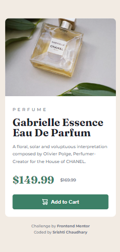

<h1 align="center">Frontend Mentor - Product preview card component solution</h1>

<div align="center">This is a solution to the <a href="https://www.frontendmentor.io/challenges/product-preview-card-component-GO7UmttRfa">Product preview card component challenge</a> on <a href="https://www.frontendmentor.io">Frontend Mentor</a></div>

<div align="center">
  <h3>
    <a href="https://product-preview-srishti.onrender.com/">
      Live Site
    </a>
    <span> | </span>
    <a href="https://github.com/itsmesrishti/fmresponsivelayouts/edit/main/product-preview-card-component-main">
      Solution
    </a>
  </h3>
</div>

## Table of contents

- [Overview](#overview)
  - [The challenge](#the-challenge)
  - [Screenshot](#screenshot)
- [My process](#my-process)
  - [Built with](#built-with)
  - [What I learned](#what-i-learned)
  - [Useful resources](#useful-resources)
- [Acknowledgments](#acknowledgments)
- [Author](#author)
  
## Overview

### The challenge

Users should be able to:

- View the optimal layout depending on their device's screen size
- See hover and focus states for interactive elements

### Screenshot

 

## My process

### Built with

- Semantic HTML5 markup
- CSS/SCSS
- Flexbox
- Mobile-first workflow

### What I learned

I learned how you can use <picture> tag to render diff images based on screen sizes.

```html
<picture>
        <source
          srcset="/images/image-product-desktop.jpg"
          media="(min-width: 64em)"
        />
        
      </picture>
```

### Useful resources

- [Flexbox Froggy](https://flexboxfroggy.com/): I had completed this game before getting started with FEM but I did it once again before starting the challenge to refresh my memory and I learned things I didn't pay attention to (like align-self, align-content) when I played the game first time.

## Acknowledgments

- [Render](https://render.com/) for hosting
- [Google Fonts](https://fonts.google.com/) for the fonts
- [Frontend Mentor](https://www.frontendmentor.io/) for providing the links to suitable resources that helped me in this project.
- [Flexbox Froggy](https://flexboxfroggy.com/) for teaching flexbox in a cool way

## Author

- Website: [itsmesrishti.github.io](https://{itsmesrishti.github.io/})
- GitHub: [@itsmesrishti](https://{github.com/itsmesrishti})
- Frontend Mentor - [@itsmesrishti](https://www.frontendmentor.io/profile/itsmesrishti)
- LinkedIn: [Srishti Chaudhary](https://{https://www.linkedin.com/in/srishtichaudhary/})
